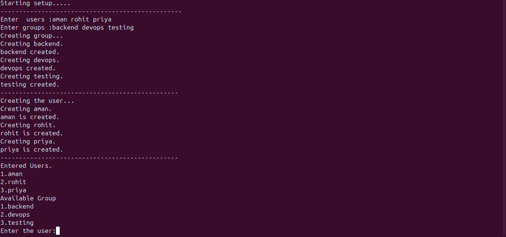
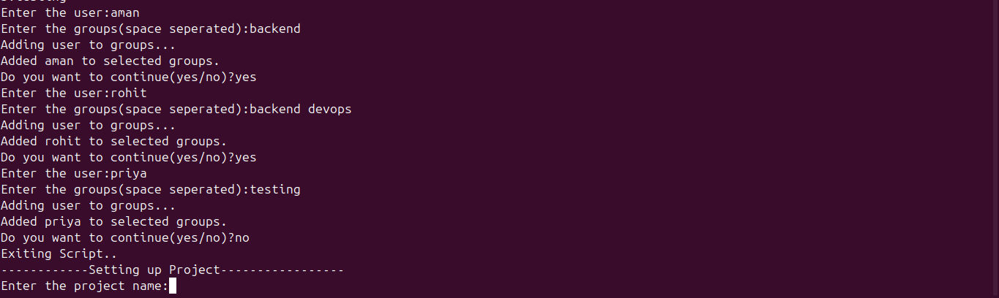
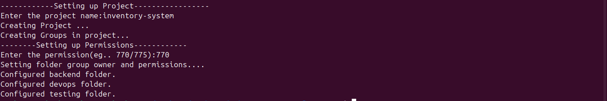

# Linux Team Access Provisioning Script
This Bash scripting project automates Linux team environment setup by creating users, groups, assigning users to groups, creating project directories, and configuring folder permissions.

## Features

- Dynamic user creation
- Dynamic group creation
- Existing user/group checks
- Interactive user-to-group assignment
- Multiple group support
- Project workspace setup
- Group-based directory creation
- Permission management using chmod
- Group ownership management using chgrp

## Workflow

1. Enter users
2. Enter groups
3. Create users and groups
4. Assign users to groups
5. Create project workspace
6. Create group-specific directories
7. Configure permissions and group ownership

## Technologies Used

- Bash Scripting
- Linux User Management
- Linux Permissions
- Git & GitHub

## Linux Commands Used

- useradd
- groupadd
- usermod
- chmod
- chgrp
- mkdir
- getent

## Future Improvements

- Input validation
- Logging support
- Menu-driven interface
- Config file support
- Remove users/groups feature

## Screenshots

